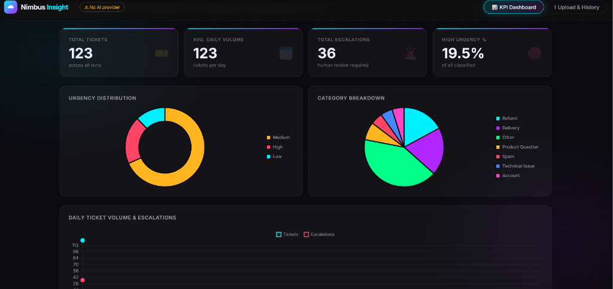
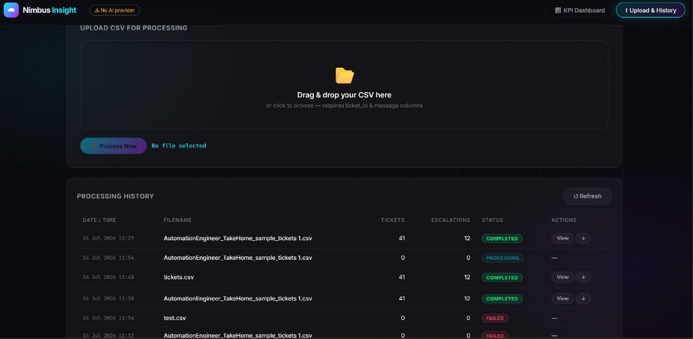

# Nimbus Retail — Automated Support Ticket Processor




This repository contains two solutions for automating the classification of Nimbus Retail support tickets using Large Language Models (LLMs):

1. **Nimbus Ticket Processor (CLI)**: A command-line script for local, automated processing.
2. **Nimbus Insight (Web App)**: A futuristic, full-stack web dashboard built with FastAPI.

Both tools accept a CSV of customer support tickets, process them against a priority chain of AI providers (OpenAI → Anthropic → Ollama), and generate a detailed report with KPIs and escalations.

---

## 🛡️ Robustness & Security Features

* **Provider Priority Chain**: Automatically falls back to the next provider if an API key is missing or fails (e.g. 401 Unauthorized, 429 Rate Limit).
* **Prompt Injection Defense**: All user-supplied ticket contents are isolated inside `<ticket_data>` XML tags. The system prompt explicitly instructs the LLM to ignore commands inside these tags.
* **File Deduplication**: Both the Web App and the CLI compute an MD5 hash of uploaded files. If you upload the exact same file twice, it skips processing and returns the existing result instantly, saving API credits.
* **Resilient Architecture**: If an AI provider returns malformed JSON or times out, the system catches it, logs a warning, and gracefully falls back to a safe "Other/Medium" classification rather than crashing the pipeline.

---

## 🚀 1. Nimbus Insight (Web Application)

A modern, Apple Vision Pro inspired SPA dashboard. Users can drag and drop CSV files, view live processing status, and monitor KPI charts.

### Setup

1. **Navigate to the web app directory:**
   ```bash
   cd nimbus_insight
   ```

2. **Install dependencies:**
   ```bash
   pip install -r requirements.txt
   ```

3. **Configure AI Providers (.env):**
   Copy the example config and edit it with your actual API keys:
   ```bash
   cp .env.example .env
   ```
   *Edit `.env` and add your `OPENAI_API_KEY` (or `ANTHROPIC_API_KEY`). Leave blank any providers you aren't using.*

### Running the Server

Start the FastAPI server using `uvicorn`:
```bash
python -m uvicorn main:app --host 0.0.0.0 --port 8000
```

*Open your browser and navigate to **http://localhost:8000***.

### Usage
* **Upload**: Go to the "Upload & History" tab and drag/drop your CSV.
* **Processing**: The UI will poll every 2 seconds until the background job completes.
* **Reports**: Click on any completed job in the history table to view the final report and any warnings.

---

## 💻 2. Nimbus Ticket Processor (CLI script)

A lightweight CLI tool suitable for cron jobs or automated server environments.

### Setup

1. **Navigate to the CLI directory:**
   ```bash
   cd nimbus_ticket_processor
   ```

2. **Install dependencies:**
   ```bash
   pip install -r requirements.txt
   ```

3. **Configure AI Providers (.env):**
   Copy the example config and edit it with your actual API keys:
   ```bash
   cp .env.example .env
   ```
   *Edit `.env` and add your keys.*

### Running the CLI

Run the Python script, passing the path to your CSV file:
```bash
python process_tickets.py "path/to/your/tickets.csv"
```

**Options:**
* `--dry-run`: Prints the generated prompt to the console instead of calling the AI provider. Good for testing prompt injection isolation.

### Outputs
* **Console Output**: A live summary is printed to the terminal.
* **report.md**: The full report is saved to `report.md` in the current directory.
* **cache.json**: A local cache file that prevents identical files and tickets from being processed twice.
